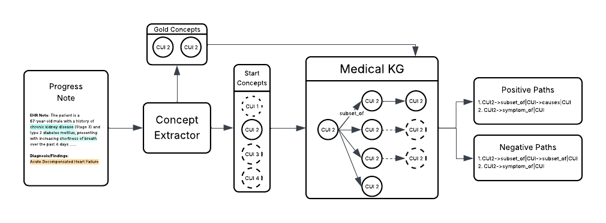

# Knowlege Graph-based Reward Modeling

## Overview
This repository contains code for the paper 'Brittleness and Promise: Knowledge Graph–Based
Reward Modeling for Diagnostic Reasoning'

Link: https://arxiv.org/pdf/2509.18316

## Data
For this paper, we have utilized the ProbSum dataset, which is available at: https://physionet.org/content/bionlp-workshop-2023-task-1a/2.0.0/
o access the data, a credentialed PhysioNet account, CITI training and a data use agreement is required.

## Setting up UMLS
We utilize the UMLS Knowledge Graph to extract the reasoning paths. This requires a working UMLS installation.

Download UMLS from the NIH website: https://www.nlm.nih.gov/research/umls/implementation_resources/metamorphosys/help.html

Then follow the instructions to install QuickUMLS https://github.com/Georgetown-IR-Lab/QuickUMLS

## How to run different training scripts

In this work, we perform Supervised Fine-Tuning (SFT), Direct Preference Optimization (DPO), and Group Relative Preference Optmization (GRPO).
These can be run using the scripts sf_train_script.py, sf_dpo_train_script.py, sft_grpo_train_script.py.

These scripts take the following arguments:

| Argument | Type | Default | Description |
|-----------|------|----------|-------------|
| `--model_name` | `str` | `Qwen/Qwen2.5-7B-Instruct` | Model name/location which you want to finetune. (It will be the finetuned model location in case of DPO and GRPO) |
| `--output_dir` | `str` | `./models/Qwen7B` | Directory to save the model. |
| `--input_dataset` | `str` | `data/processed` | Path to the processed dataset for training. |
| `--val_dataset` | `str` | `data/processed_val` | Path to the processed dataset for evaluation step between training. |

To run merge multiple models, model_merge.py can be used. It takes the arguments:

| Argument | Type | Default | Description |
|-----------|------|----------|-------------|
| `--model_names` | `list of string` | `path1`  `path2` | space separated paths of the model you want to merge. |
| `--model_weights` | `list of float` | `0.5` `0.5` | Importance that you want to give to each model. |
| `--output_path` | `str` | `./models_merged/Qwen7B` | Directory to save the merged model. |

For Chain-of-Thought distillation, you must first get the reasoning traces from a teacher model like GPT-4o-mini. Afer that:
1. For Distillation Step by Step, you can run ./cot-distillation/main.py script.
2. For RM-R1, you must first perform SFT over the reasoning traces, then GRPO with ./RM-R1-distillation/GRPOTrainer.py script.

## Evaluation Scripts

We have task specific evaluation script evaluate_models.py.

